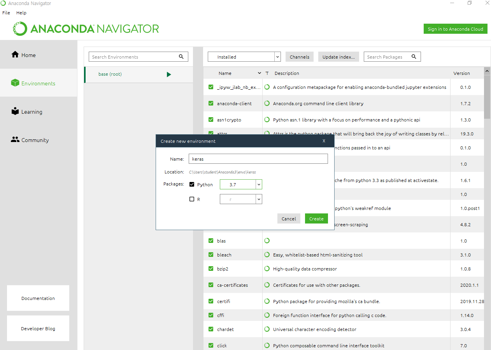
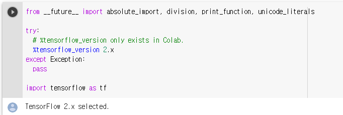

flask - 파이썬에 바로 붙일 수 있는 스프링부트


응용프로그래머 

시스템 프로그래머 ---- >OS

										1. 범용운영체제 ( Windows ,Linux) - 32bit, 64bit
   										2. 펌웨어(Chip---> 8bit PICC, 8051// 16bit ATmega128,256 --> 아이리버, 네비게이션)

​										 Linux ----> Kernel, Driver ----> IoT


32bit 가 쓸 수 있는 공간은 약 4G만큼 사용할 수 있는데 운영체제가 반을 차지한다. 약 2G

C나 C++은 메모리를 절약할 수 있다.

자바의 array list 등은 게임으로 만들면 느리다. Java Vertual Machine은 알아서 메모리를 다뤄준다 ... 

단점 : 자바는 중복이 많고 반복이 많아서 간결하지 않고 산만함

파이썬, 루비가 극 단점을 보완하는 간결한 언어들

요즘 나온 언어 Rust : 

파이썬의 의존성 : 자바나 C보다는 쉽고 간결하게 사용하고 싶다(모듈) // 단점 : 파이썬은 의존성을 맞춰줘야 함.  Virtual Env(클라우드 서비스에 , Anaconda


3. 클라우드 --- Intel(Xeon) ---> X86으로 천하통일됨 현재는

   ARM Server -->  

   디바이스에 인공지능 섞어서 하고 싶어하는 우리나라 

   arm의 PELION이라는 게 있다. : 임베디드 펠리온(아두이노 같은 느낌)


**YOLOv3** 

큰 회사는 하나만 잘하는 사람 뽑는다 (알고리즘)

작은 회사는 RNN openCV // pandas //  


#### 로그 관리

 elastic search(라이트한 검색엔진)

kibana

splunk

Tableau


```
Object obj = new Object();
```


솔트룩스

DL4J

와이즈넛

클라우데라


하둡에코시스템


공부를 하려면 하둡을 먼저 하고... 스파크로 넘어가고

씨맵... 


케라스나 텐서플로보다 요즘 파이토치가 인기 있다


#### 가상환경 만들기




AWS Polly - 딥러닝을 사용하여 텍스트를 생생한 음성으로 전환

CMD 창에서

```shell
C:\Users\student>conda activate

(base) C:\Users\student>conda activate [내가 생성한 가상환경이름]
```


```
(keras) C:\Users\student>conda list | find "numpy"
```

conda list에서 numpy가 있는지


#### TensorFlow 실행하기

- 텐서플로우 홈페이지- tensorflow 실행하기- 초보자용 지금 코드 실행
- 실행 - ctrl+enter




```python
from __future__ import absolute_import, division, print_function, unicode_literals

try:
  # %tensorflow_version only exists in Colab.
  %tensorflow_version 2.x
except Exception:
  pass

import tensorflow as tf
```


딥러닝은 이제 공법화가 되었다

```
model = tf.keras.models.Sequential([
  tf.keras.layers.Flatten(input_shape=(28, 28)),
  tf.keras.layers.Dense(128, activation='relu'),
  tf.keras.layers.Dropout(0.2),
  tf.keras.layers.Dense(10)
])
```

sequential - 순차적으로..하나끝나면 하나시작하고 하는 모델

### colab

https://colab.research.google.com/

https://github.com/HaSense/Keras/blob/master/keras001.ipynb


둘을 합쳐서 

https://colab.research.google.com/github/HaSense/Keras/blob/master/keras001.ipynb

이렇게 만들어서 간다!


영상처리에서 컴퓨터가 흑백사진을 처리할 때 0은 검정 255은 하얀색

컬러면 RGB로 세개의 채널이 있어야 함

= 정수 배열을 통해 그림을 만들 수 있다


anaconda를 통해 keras 만 설치해도 tensorflow도 설치가 된다


v8 javascript engine - 5년전 부터 기조가 달라져서 노드js만 쓰던 사람들이 좀 더 튼튼해지고 있는 v8을 


