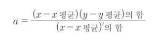
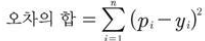
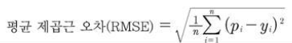

# 선형회귀/ 로지스틱회귀

- 딥러닝의 가장 말단에서 이루어지는 가장 기본적인 두 가지 계산 원리


#### 독립변수, 종속변수

- 독립적으로 변할 수 있는 값 : 독립변수
- 독립변수에 따라 종송적으로 변하는 값 : 종속변수


#### 단순 선형회귀

- 하나의 x 값만으로도 y값을 설명 할 수 있는 경우


#### 다중 선형 회귀

- 독립변수가 x 하나 뿐이어서 이것만으로는 정확히 설명 할 수 없는 경우, 여러 x1, x2 ,x3 등 값을 여러개 준비 해 놓을 수 있다. 


## 최소제곱법

> 회귀 분석에서 사용되는 표준 방식
>
> 실험이나 관찰을 통해 얻은 데이터를 분석하여 미지의 상수를 구할 때 사용되는 공식

- **기울기 a 구하기**



- 편차 : 각 값과 평균과의 차이
- 분모 : x의 평균값과 x의 각 원소들의 차를 제곱

- **y 절편인 b 구하기**
- b = y의 평균 - (x의 평균 × 기울기 a)
- 예측값 : x를 대입 했을 때 나오는 y 값

### 코딩

```python
import numpy as np

x = [2, 4, 6, 8]
y = [81, 93, 91, 97]
mx = np.mean(x)
my = np.mean(y)
```

- np.mean()을 통해 평균을 리스트의 원소들의 평균 값을 구한다

- 분모를 구한다

  ```python
  divisor = sum([(mx - i)**2 for i in x])
  ```

  - sum() : 시그마에 해당하는 함수
  - x의 각 원소를 한 번씩 i 자리에 대입하라는 뜻

- 분자를 구한다

  ```python
  def top(x, mx, y, my):
      d = 0
      for i in range(len(x)):
          d += (x[i] - mx) * (y[i] - my)
      return d
  dividend = top(x, mx, y, my)
  ```

  - top이라는 함수 생성
  - 임의의 변수 d의 초기값 0으로 설정
  - x의 개수만큼 for문 돌린다
  - d에 (x의 각 원소와 평균의 차)*(y의 각 원소와 평균의 차)를 차례로 더한다

- ```python
  a = dividend / divisor
  # 기울기
  b = my - (mx*a)
  # y절편
  ```


## 평균 제곱근 오차

> 최소제곱법만으로는 여러 개의 입력을 처리하기에는 무리가 있음
>
> 여러개의 입력값을 계산 할 때는 임의의 선을 그리고 난 후, 이 선이 얼마나 잘 그려졌는지를 평가하여 조금씩 수정해 가는 방법을 사용


### 일단 그리고 조금씩 수정해 나가기

> 가설을 하나 세운 뒤 이 값이 주어진 요건을 충족하는지 판단하여 조금씩 변화를 주고, 
>
> 이 변화가 긍정적이면 오차가 최소가 될 때까지 이 과정을 계속 반복

- 일단 그린 직선과 실제값과의 직선 거리

  - 오차 : 실제값 - 예측값

  - 입력 데이터에 나와 있는 y의 ‘실제 값’과 x를 y = 3x + 76(예시)의 식에 대입해서 나오는 ‘예측 값’과의 차이를 통해 구할 수 있음

- 오차를 다 더하려니 음수와 양수가 섞여 있어 부호를 없애주기 위해 각 오차의 값을 제곱해 주고 더한다

  

  - i : x가 나오는 순서
  - n : x 원소의 총 개수
  - pi : xi에 대응하는 실제값
  - yi : xi가 대입되었을 때 직선의 방정식이 만드는 예측값

#### 평균 제곱 오차 ( Mean Squared Error, MSE)

- 오차의 합들을 n으로 나눈 것 : 오차 합의 평균


#### 평균 제곱근 오차 ( Root Mean Squared Error, RMSE)

- 평균제곱 오차가 너무 커서 쓰기 불편한 경우 사용
- 대용량 데이터를 이용 할 때 계산 속도가 느려질 수 있음




### 코딩

- 임의로 정한 기울기와 y절편

  ```python
  ab = [3, 76]
  ```

- ```python
  data = [[2, 81], [4, 93], [6, 91], [8, 97]]
  x = [i[0] for i in data]
  y = [i[1] for i in data]
  ```

- 내부 함수 만들기

  ```python
  def predict(x):
      return ab[0]*x + ab[1]
  ```

  - 일차방정식 y = ax + b를 구현

- 평균 제곱근 공식

  ```py
  def rmse(p, a):
      return np.sqrt(((p - a) ** 2).mean())
  ```

  - nq.sqrt() : 제곱근
  - 예측값과 실제값을 각각 rmse()라는 함수의 p와 a 자리에 입력해서 평균 제곱근을 구함

- rmse()함수에 데이터를 대입하여 최종값을 구하는 함수 rmse_val()을 만든다

  ```python
  def rmse_val(predict_result,y):
  
      return rmse(np.array(predict_result), np.array(y))
  ```

  


